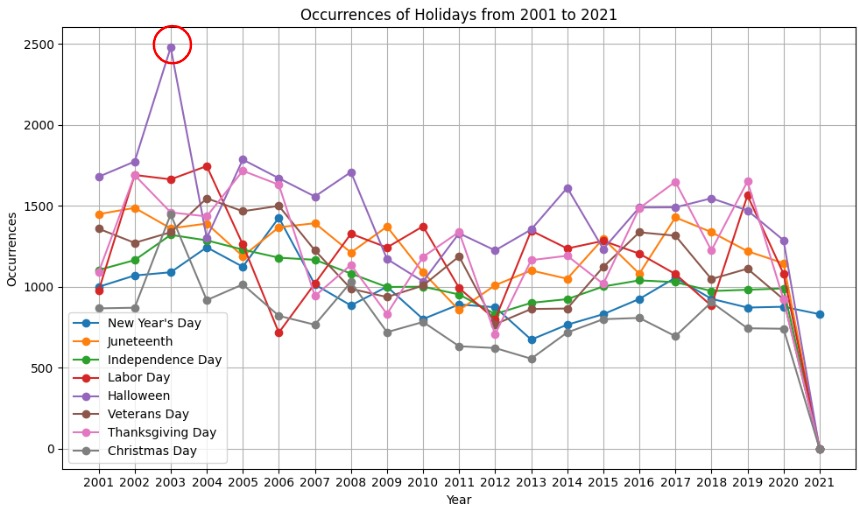

# 📌 Project Background 

California, specifically in the vibrant city of Irvine, stands out for its characteristic car-centric lifestyle, a defining element that shapes the state's identity. This report aims to go beyond mere statistics and delve into the nuanced factors contributing to car accidents. By doing so, our objective is not only to provide a meticulous examination of accident frequency but also to illuminate the underlying dynamics that influence these incidents.   

<i>In collaboration with Angel Sheu, Tracey Liu, and Lisa Rumao.</i>

Our project questions include:   
- What type of car/motorcycle was involved in the most crashes?
- Were there more car accidents than usual during the holidays?
- Were there more accidents around sunrise/sunset?
- Were DUIs more likely on certain days?

This project uses the California Traffic Collision Data [Dataset](https://www.kaggle.com/datasets/alexgude/california-traffic-collision-data-from-switrs/data) from Kaggle.    
- Collisions table: Covers details such as collision location, road conditions, weather, collision severity, type, and hit-and-run status.
- Parties table: Encompasses information on involved individuals, including their age, sex, and sobriety.
- Victims table: Focuses on specific individuals' injury details resulting from the collisions, offering a holistic perspective on the incidents.

# 🛠️ Analyzing tools
- Our research methodology seamlessly integrated Python and SQL for efficient data gathering and analysis. Leveraging the power of linear regression, we conducted correlation studies to unveil meaningful insights.
- The visualization aspect of our study was enriched using Matplotlib and Seaborn, enabling the creation of insightful heatmaps, bar charts, and pie charts.
- We utilized a comprehensive toolkit consisting of Pandas and NumPy for data manipulation, SQLite3 for database management, Folium for geographical visualizations, and Plotly Express for interactive data visualization in our analysis.

# 📊 Exploratory Data Analysis  
- This geographical insight is a valuable starting point for further investigation into the factors that contribute to higher incident rates in these areas.
- By identifying these locations, policymakers and local authorities can customize interventions to address unique challenges in each area, ultimately leading to targeted road safety improvements.
    
      
      
- Next, we analyzed the gender and race distribution of the collision parties and found that there was an even split, with 60% male and 40% female, and representation from diverse racial backgrounds including white, Hispanic, black, and Asian.  
    
      
      
- During our research, we paid particular attention to age-related trends and found that drivers between the ages of 20 and 30 have the highest collision rates. This finding is in line with the higher insurance rates charged to younger drivers, as shown in the age and fault distribution chart. The chart demonstrates that younger drivers are at fault more often, which affects insurance premiums.
    
      
    
    
      
      
- After analyzing the data provided, we have noticed a decrease in collision rates in California. This trend is consistent and warrants further investigation into the factors that may have contributed to it, possible interventions that can be implemented, and the implications for road safety measures.
    
      
    
- In different vehicle categories, motor or scooter has the most collisions, 300000 cases, for the past 20 years. Although these vehicles are not commonly seen on the street in America, they still have the highest amount of collisions, which means these vehicles can be really dangerous. The second and third highest collision amounts are from cars and trucks. They respectively had 170000 and 20000 collision cases for the past 20 years.
    
       
    
- In those three categories, we analyzed the relationship between the brands and safety. For motors or scooters, harley-davidson, Ducati, Honda, and Suzuki have the most people killed in collisions. The highest rate was around 4.2%. On the contrary, BMW has the least people killed in collisions.
    
       
    
- Look at the car category: Ford, Chevrolet, and Dodge have the most people killed in the collisions. The highest rate was 3.3%. On the other hand, Honda, Nissan, and BMW have the least number of people killed in collisions. However, considering the price and gas savings, most people usually buy a Honda or Nissan when they start working.
    
       
    
- Look at the trucks. Dodge had the most people killed in the collisions, the rate was greater than 6%. Toyota and Nissan were the safest brands, with the fewest fatalities from collisions.
    
       
    
- Look at the collisions at different times of the day. As mentioned, the categories of motorcycle or scooter, car, and truck have the most collisions. We can see that most collisions happen from 3 pm to 6 pm and the number peaks at 5 pm, which is the time the sun sets and people get off of work. When the sun is setting, the sunlight will become very strong. On top of that, many people will rush back home which might result in not driving carefully.
    
       
    
- In the occurrences in the holiday chart, we can give some insights. Considering certain holidays (such as Halloween) have consistently shown high accident rates over the years, the government may consider intensifying traffic regulations during these dates.
    
       
    
- Age vs. Total Alcohol Involved: There is a significant decline in the number of incidents involving alcohol as age increases. The highest number of alcohol-involved cases occurs among individuals between the ages of 20 to 29 (ages 16 to 20 have relatively lower cases), after which there's a gradual decrease as age advances.
- Age vs. Total Collisions: Total collisions generally follow a downward trend as age progresses. The highest number of collisions tends to occur among younger individuals (ages 16 to 25), while older age groups (from around 30 onwards) experience fewer collisions.
    
       
    

  
Highlighting these relationships helped us gain a deeper understanding of the data which offered valuable insight as we continued our analysis through machine learning models.  

# 👣 Our Approach
Regression analysis traditionally aims to predict the correlation between sobriety and collisions. 
We utilized this approach to maintain a straightforward and precise analysis, providing valuable insights for policymakers and public safety officials. 
By focusing on the continuous relationship between sobriety levels and collision frequencies, we aim to assess the accuracy and performance of the regression models we selected.   

# 🧽 Data Cleaning  
1. We defined sobriety_encoded as our dependent variable.   
2. Then, we dropped the missing values.
    
      
    
3. We removed any duplicated data to ensure its cleanliness.
    
      
    

This "cleaned" dataset served as our initial benchmark for subsequent machine-learning experiments.  

# 📈 Statistical Analysis
### Regression Model
- Regression Analysis to predict the correlation between sobriety and collisions:
    
      
      
- This model aims to predict sobriety_encoded, a numerical representation of the party_sobriety categories, using killed_victims and injured_victims as predictors.
  
## Coefficients:
- R-squared (0.018): This value is quite low, indicating that only about 1.8% of the variation in the sobriety_encoded can be explained by the independent variables in the model. This suggests that the model does not capture most of the variability in the sobriety status, and there may be other significant factors not included in the model.
- Constant (1.3863): This value represents the expected sobriety_encoded score when both independent variables (killed_victims and injured_victims) are zero. The interpretation of this constant should be in the context of how sobriety_encoded was defined.
- killed_victims (0.4844): This positive coefficient indicates that as the number of killed victims increases, the sobriety_encoded value tends to increase. This suggests a positive association between the number of fatalities in an incident and the encoded sobriety status. The relationship is statistically significant, given the low p-value.
- injured_victims (-0.0970): The negative coefficient here implies that an increase in the number of injured victims is associated with a decrease in the sobriety_encoded value. This is statistically significant but suggests a weaker relationship compared to the killed_victims.
- P-values: The p-values for both killed_victims and injured_victims are effectively zero, indicating strong statistical significance. This means that it is very unlikely that these relationships are due to chance.

# 🔑 Key Takeaways    
1. High Risk of Two-Wheeled Vehicles:
   - Motorcycles and scooters pose a higher risk compared to other transportation modes.
   - There is a need for increased safety awareness, proper training, and the use of appropriate safety gear for riders.
2. Importance of Safe Driving Habits:
   - Wearing sunglasses while driving can significantly reduce risks associated with glare
   - Avoiding unnecessary travel during high-risk times, such as Halloween, can enhance road safety.
3. Insurance Benefits for Young Drivers:
   - Car insurance rates drop by 9% for individuals at age 25, reflecting increased driving maturity and responsibility.
   - This reduction serves as an incentive for young drivers to adopt cautious driving behaviors.
4. Comprehensive Approach to Road Safety:
   - Addressing road safety involves multiple facets, including demographic-specific interventions, promoting safety measures for high-risk vehicles, recommending safer vehicle brands, encouraging safe driving habits, and recognizing insurance trends.
   - Informed decision-making and targeted interventions are essential for fostering a safer and more responsible driving culture.
  

# ☁️ Project Improvements  
1. Advanced Analytical Techniques:
   - Utilize machine learning models to predict collision likelihood based on various factors, providing deeper insights into risk patterns.
   - Apply clustering algorithms to identify and analyze collision hotspots, leading to more targeted interventions.
2. Demographic-Specific Studies:
   - Conduct separate analyses for different age groups and socioeconomic backgrounds to identify unique patterns and tailor interventions accordingly.
   - Explore the impact of educational and awareness campaigns on driving behaviors across demographics.
3. Detailed Vehicle Safety Analysis:
   - Expand the scope to include more vehicle brands and models, providing a broader range of safety recommendations.
   - Perform a more granular analysis of vehicle safety features and their effectiveness in preventing collisions.

